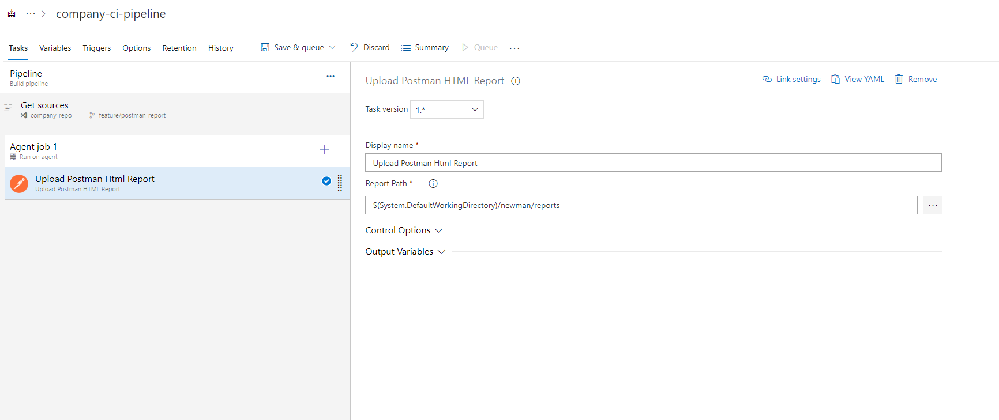

# Azure Devops Postman HTML Report

## About

This Azure DevOps extension provides task for Publishing Postman / Newman HTML Reports into built into Azure Storage.

Reports can be viewed as a tab in Build and Release result pages.
Tab contains embeded reports as well as direct download links.

## Configuration

In order to use this extension first add `Upload Postman HTML Report` task to your pipeline. In your Postman / Newman execution task add `htmlextra` reporter that will generate `HTML` reports.

This tasks requires only one parameter which is path to the location where HTML reports are stored.

## Example

### Report summary on build tab

## Contributors
<!-- prettier-ignore-start -->
<!-- markdownlint-disable -->
<table>
  <tr>
      <td align="center">
      <a href="https://github.com/afeblot">
        
         
        <b>Maciej Maciejewski</b>
    </td>
    <td align="center">
      <a href="https://github.com/afeblot">
        
         
        <b>Alexandre Feblot</b>
    </td>
  </tr>
</table>
<!-- markdownlint-enable -->
<!-- prettier-ignore-end -->